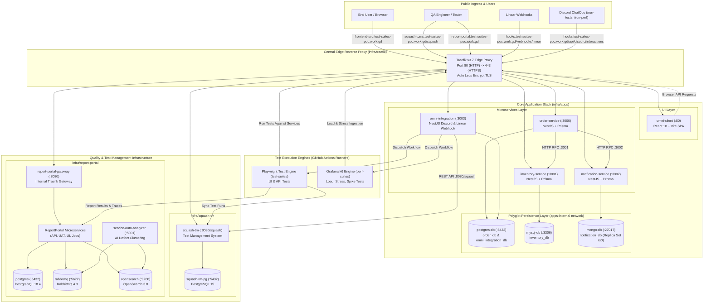

<div align="center">

# 🌐 Omni-Suites Ecosystem
### An Enterprise Quality Engineering & Test Automation Workflow for Agile-Driven Teams

[](https://www.typescriptlang.org/)
[](https://nestjs.com/)
[](https://react.dev/)
[](https://playwright.dev/)
[](https://k6.io/)
[](https://docs.docker.com/compose/)
[](https://traefik.io/)
[](https://reportportal.io/)
[](https://www.squashtest.com/)

<p align="center">
  A state-of-the-art cloud native platform orchestrating polyglot microservices, distributed persistence, centralized E2E and performance automation suites, automated test case synchronization with Linear and Squash TM, and Discord-based ChatOps CI/CD dispatch.
</p>

</div>

---

## 📖 Table of Contents

1. [Executive Overview & Vision](#-executive-overview--vision)
2. [Global Architecture & End-to-End Topology](#-global-architecture--end-to-end-topology)
3. [Organization Repositories Directory](#-organization-repositories-directory)
4. [The System Under Test (SUT)](#-the-system-under-test-sut)
5. [Quality Engineering & Automation Platforms](#-quality-engineering--automation-platforms)
   - [Centralized Playwright E2E & API Suites](#1-centralized-playwright-e2e--api-suites-test-suites)
   - [Centralized Grafana k6 Performance Testing](#2-centralized-grafana-k6-performance-testing-perf-suites)
   - [Test Management & Linear Webhook Sync (Squash TM)](#3-test-case-management--linear-sync-squash-tm)
   - [AI-Driven Defect Analytics & Reporting (ReportPortal)](#4-ai-driven-test-analytics--dashboards-reportportal)
6. [ChatOps & Developer Experience (Discord Bot)](#-chatops--developer-experience-discord-bot)
7. [Cloud Infrastructure, Staging VM & Ingress](#-cloud-infrastructure-staging-vm--ingress)
8. [Master Public Routing Directory](#-master-public-routing-directory)
9. [Security, Networking & Secrets Management](#-security-networking--secrets-management)
10. [Local Development & Contribution Workflow](#-local-development--contribution-workflow)

---

## 🎯 Executive Overview & Vision

Modern engineering organizations operating distributed microservices frequently suffer from **QA fragmentation**: tests are siloed inside application repositories, performance benchmarks are run inconsistently, test case management is disconnected from sprint tickets, and results are scattered across individual CI runner logs.

**Omni-Suites** solves this by establishing a centralized, enterprise-grade Quality Engineering ecosystem:
* **Decoupled Automation Platforms**: Centralized repositories for E2E/API testing ([`test-suites`](https://github.com/omni-suites/test-suites)) and load/performance testing ([`perf-suites`](https://github.com/omni-suites/perf-suites)) that run against ephemeral, staging, or production environments without modifying application source code.
* **Bi-Directional Requirement Traceability**: Issues in **Linear** labeled with `ready-for-tc` automatically synchronize with **Squash TM** via [`omni-integration`](https://github.com/omni-suites/omni-integration), auto-generating structured test cases and preserving test coverage history.
* **Unified Observability & AI Categorization**: All browser and API test executions automatically publish metrics, error logs, and failure screenshots directly to a self-hosted **ReportPortal v5.15** cluster with automated defect classification.
* **Interactive ChatOps**: Team members can execute on-demand regression suites (`/run-tests`) or stress benchmarks (`/run-perf`) directly from **Discord**, streaming real-time embeds and artifact links back into communication channels.

---

## 🏛️ The System Architecture


## 🏛️ Global Architecture & End-to-End Topology



---

## 🗂️ Organization Repositories Directory

| Repository | Category | Core Stack | Description |
| :--- | :--- | :--- | :--- |
| [**`omni-client`**](https://github.com/omni-suites/omni-client) | Application | React 18, Vite, TypeScript | Customer-facing e-commerce storefront SPA with real-time inventory updates and purchase notifications. |
| [**`order-service`**](https://github.com/omni-suites/order-service) | Application | NestJS, Prisma, PostgreSQL 15 | Core transactional order fulfillment microservice orchestrating inventory deduction and notifications. |
| [**`inventory-service`**](https://github.com/omni-suites/inventory-service) | Application | NestJS, Prisma, MySQL 8 | Inventory ledger and stock management service with atomic deduction routines and auto-seeding. |
| [**`notification-service`**](https://github.com/omni-suites/notification-service) | Application | NestJS, Prisma, MongoDB 6 (`rs0`) | Event notification microservice utilizing MongoDB replica set for transaction-safe alert persistence. |
| [**`omni-integration`**](https://github.com/omni-suites/omni-integration) | Integration | NestJS, Prisma, PostgreSQL 15 | Central middleware for Linear webhooks, Squash TM synchronization, and Discord slash command ChatOps. |
| [**`test-suites`**](https://github.com/omni-suites/test-suites) | Quality & QA | Playwright, TypeScript, Node.js | Centralized browser E2E and HTTP API test automation framework streaming to ReportPortal. |
| [**`perf-suites`**](https://github.com/omni-suites/perf-suites) | Quality & QA | Grafana k6, TypeScript, Webpack | Centralized load, stress, spike, and performance benchmark suites with custom reporting. |
| [**`infra`**](https://github.com/omni-suites/infra) | Platform & Ops | Docker Compose, Traefik v3 | Staging infrastructure orchestration: Traefik proxy, all business applications, Squash TM, and ReportPortal. |
| [**`.github`**](https://github.com/omni-suites/.github) | Management | GitHub Community & Profile | Central organization documentation, community health files, and platform guides. |

---

## 🛒 The System Under Test (SUT)

The business platform simulates a multi-tier e-commerce order workflow:

```text
[User clicks Buy on omni-client]
          │
          ▼
    [POST /orders] ──────────────────────────┐
          │ (HTTP RPC :3001)                 │
          ▼                                  ▼
[POST /inventory/deduct]               [POST /notifications] (HTTP RPC :3002)
          │                                  │
          ▼                                  ▼
   (Deducts stock in MySQL)          (Logs event in MongoDB replica set)
          │                                  │
          └────────────────┬─────────────────┘
                           ▼
             (Persists Order in PostgreSQL)
                           │
                           ▼
          [Order Confirmation Displayed in UI]
```

### Microservice Endpoints
* **Order Service (`:3000`)**: `POST /orders`, `GET /orders`, `GET /orders/:id`, `GET /health`
* **Inventory Service (`:3001`)**: `GET /inventory`, `POST /inventory/deduct`, `GET /health`
* **Notification Service (`:3002`)**: `GET /notifications`, `POST /notifications`, `GET /health`
* **Omni Integration (`:3003`)**: `POST /webhooks/linear`, `POST /api/discord/interactions`, `GET /health`

---

## 🧪 Quality Engineering & Automation Platforms

### 1. Centralized Playwright E2E & API Suites (`test-suites`)
* **Technology**: Playwright Test, TypeScript, Page Object Model (POM), custom domain fixtures.
* **Scope**: Multi-browser E2E testing (Chromium, Firefox, WebKit), end-to-end purchasing flows, and standalone REST API validation against microservice contracts.
* **Execution Options**: Triggered via GitHub Actions `workflow_dispatch`, scheduled nightly runs, or Discord ChatOps.
* **Direct Integration**: Native reporting into **ReportPortal** using `@reportportal/agent-js-playwright` and test status syncing into **Squash TM**.

### 2. Centralized Grafana k6 Performance Testing (`perf-suites`)
* **Technology**: Grafana k6, TypeScript, Webpack bundling, Domain-Driven Design layout (`src/core`, `src/modules`, `src/journeys`).
* **Workload Profiles**:
  * `smoke`: Quick verification of performance baseline.
  * `load`: Sustained target VU throughput testing.
  * `stress`: Ramp-up beyond capacity to detect degradation breakpoints.
  * `spike`: Instant surge in concurrent traffic to test elastic recovery.
* **Quality Gates**: Strict SLA thresholds evaluated at runtime (e.g. `p(95) < 500ms`, `errors < 1%`).
* **Artifact Reporting**: Automated HTML performance dashboards, raw metric summaries (`summary.json`), and GitHub Actions job summaries.

### 3. Test Case Management & Linear Sync (`squash-tm`)
* **Technology**: Squash TM (Java Spring Boot), PostgreSQL 15.
* **Automated Sync**: When developers or PMs label a ticket in Linear with `ready-for-tc`:
  1. Linear fires a webhook to `https://hooks.test-suites-poc.work.gd/webhooks/linear`.
  2. `omni-integration` validates the secret and parses preconditions, steps, and expected results.
  3. A new test case is created in Squash TM under project `omni-suites`.
  4. Mapping IDs are idempotently recorded in `omni_integration_db`.

### 4. AI-Driven Test Analytics & Dashboards (`report-portal`)
* **Technology**: ReportPortal v5.15 (12 microservices, PostgreSQL 18, RabbitMQ, OpenSearch, Python ML auto-analyzer).
* **Capabilities**:
  * Real-time test log streaming and video/screenshot artifact ingestion.
  * Flaky test identification and execution trends across releases.
  * Machine learning defect triage: automatically clusters failures into *Product Bug*, *Automation Bug*, *System Issue*, or *To Investigate*.

---

## 🤖 ChatOps & Developer Experience (Discord Bot)

Omni-Suites embeds QA triggers directly into developer team workflows through Discord Slash Commands:

| Command | Arguments | Action |
| :--- | :--- | :--- |
| **`/run-tests`** | `environment` (`dev`/`staging`), `suite` (`smoke`/`regression`/`api`/`order`/`inventory`), `browser` (`chromium`/`firefox`/`webkit`), `workers` | Dispatches Playwright test workflow on GitHub Actions. |
| **`/run-perf`** | `profile` (`smoke`/`load`/`stress`/`spike`), `service` (`all`/`order`/`inventory`/`notification`/`checkout`), `duration`, `vus` | Dispatches k6 performance suite on GitHub Actions. |

Upon completion, the bot posts rich status embeds to the `#test-releases` channel containing pass/fail metrics, duration, and direct links to GitHub Actions summaries and ReportPortal launches.

---

## ☁️ Cloud Infrastructure, Staging VM & Ingress

The staging cloud environment runs on a dedicated virtual machine (`/opt/omni-infra`) managed with modular Docker Compose stacks:

```text
/opt/omni-infra/
├── traefik/         # Ingress reverse proxy, TLS termination, edge network
├── apps/            # Microservices, omni-client, databases (Postgres, MySQL, Mongo)
├── squash-tm/       # Squash TM application & dedicated PostgreSQL database
└── report-portal/   # ReportPortal v5.15 distributed analytics cluster
```

### Network Isolation Policy
* **`edge` (External Bridge)**: Created by Traefik. Connects public-facing HTTP backends (`omni-client`, `order-service`, `inventory-service`, `notification-service`, `omni-integration`, `squash-tm`, `report-portal-gateway`).
* **`apps-internal` (Private)**: Completely isolates databases (`postgres-db`, `mysql-db`, `mongo-db`) and direct inter-service RPC calls.
* **`squash-internal` (Private)**: Dedicated link between `squash-tm` and its PostgreSQL instance.
* **`reportportal` (Private)**: Internal mesh between ReportPortal microservices, PostgreSQL 18, RabbitMQ, and OpenSearch.

---

## 🌐 Master Public Routing Directory

All services are publicly resolved via HTTPS under the `test-suites-poc.work.gd` domain:

| Domain Name | Target Component | Service Port | Protocol | Description |
| :--- | :--- | :--- | :---: | :--- |
| `frontend-svc.test-suites-poc.work.gd` | `omni-client` | `80` | HTTPS | Customer Frontend Web UI |
| `order-svc.test-suites-poc.work.gd` | `order-service` | `3000` | HTTPS | Order Microservice REST API |
| `inventory-svc.test-suites-poc.work.gd` | `inventory-service` | `3001` | HTTPS | Inventory Microservice REST API |
| `notification-svc.test-suites-poc.work.gd` | `notification-service`| `3002` | HTTPS | Notification Microservice REST API |
| `hooks.test-suites-poc.work.gd` | `omni-integration` | `3003` | HTTPS | Linear Webhooks & Discord Bot API |
| `squash-tcms.test-suites-poc.work.gd/squash` | `squash-tm` | `8080` | HTTPS | Squash TM Test Case Management |
| `report-portal.test-suites-poc.work.gd` | `report-portal-gateway`| `8080` | HTTPS | ReportPortal Analytics & Dashboards |

---

## 🔐 Security, Networking & Secrets Management

1. **Firewall & Ingress Surface**:
   * Only ports `22` (SSH), `80` (HTTP challenge / redirect), and `443` (HTTPS) are exposed on the host VM.
   * **Zero Host Database Ports**: No database ports (`5432`, `3306`, `27017`, `9200`, `5672`) are published to the host or internet.
2. **Automated SSL/TLS**:
   * Traefik v3 manages Let's Encrypt certificates using ACME HTTP-01 challenges, storing keys securely in the `letsencrypt` Docker volume (`/letsencrypt/acme.json`).
3. **Cryptographic Validation**:
   * Linear webhooks verify HMAC signatures against `LINEAR_WEBHOOK_SECRET`.
   * Discord interactions verify cryptographic Ed25519 signatures against `DISCORD_PUBLIC_KEY`.
4. **Environment Isolation**:
   * All `.env` files are strictly excluded from version control via `.gitignore`.
   * GitHub Actions secrets and variables inject credentials securely into CI/CD runners.

---

## 💻 Local Development & Contribution Workflow

### Cloning the Workspace
```bash
# Clone the central workspace
git clone https://github.com/omni-suites/.github.git omni-suites
cd omni-suites

# Clone individual repositories into app/ and quality suites
git clone https://github.com/omni-suites/omni-client.git app/omni-client
git clone https://github.com/omni-suites/order-service.git app/order-service
git clone https://github.com/omni-suites/inventory-service.git app/inventory-service
git clone https://github.com/omni-suites/notification-service.git app/notification-service
git clone https://github.com/omni-suites/omni-integration.git app/omni-integration
git clone https://github.com/omni-suites/test-suites.git test-suites
git clone https://github.com/omni-suites/perf-suites.git perf-suites
git clone https://github.com/omni-suites/infra.git infra
```

### Running Test Automation Locally

#### Playwright E2E & API Suites
```bash
cd test-suites
cp .env.sample .env
npm install
npx playwright test --project=chromium
```

#### Grafana k6 Performance Suites
```bash
cd perf-suites
cp .env.sample .env
npm install
npm run build
npm run test:smoke
```

---

<div align="center">
  <sub>Built with ❤️ by the <b>Omni-Suites</b> Engineering & Quality Assurance Team.</sub> <br>
  <sub>An Architecture and Concept by <a href="https://github.com/moshdev2213">moshdev2213</a>.</sub>
</div>